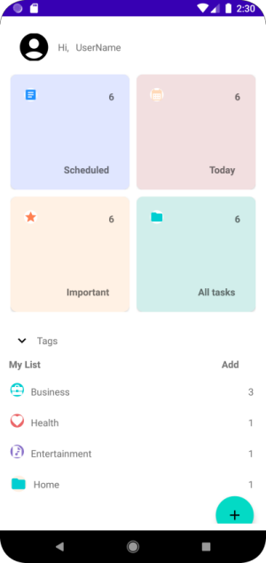

### ManageTasks - Manage and schedule your tasks
A task management app that manages your tasks and schedules. It is able to set and send notification for the various schedules. The schedules can be classified into categories and also add tags to them. The tasks can be classified depending on the time and also if important.
ManageTasks is an android application built in kotlin with the intention to help user plan ahead.

### Screenshot and Demo

#### Light Theme
Home Screen             |  AddTask Screen             | AllTask Screen
:-------------------------:|:-------------------------:|:-------------------------:
  |    | 

### Tools and library
The following tools and library were used to build this app;
- [Kotlin](https://kotlinlang.org/) - Kotlin is a programming language that running on JVM with immense support from google and the entire tech community.
- [Dagger Hilt](https://dagger.dev/hilt/)- Dagger Hilt is a dependency injection framework for android. It is used in ManageTask to manage dependencies and provide a cleaner architecture.
- [View Models](https://developer.android.com/topic/libraries/architecture/viewmodel) - View Models are used in ManageTask to manage the app's UI related data. They provide a way for the app to survive configuration changes, such as screen rotations.
- [Room Database](https://developer.android.com/training/data-storage/room) - Room Database is a persistence library used for storing data locally. It stores the tasks locally.
- [Work Manager](https://developer.android.com/reference/androidx/work/WorkManager) - a background processing library which is used to execute background tasks which should run in a guaranteed way but not necessarily immediately. It is used in ManageTasks to set notifications.

### Overall architecture
