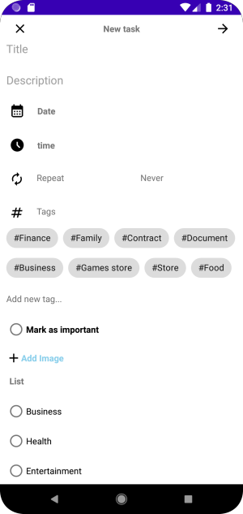

### ManageTasks - Manage and schedule your tasks
A task management app that manages your tasks and schedules. It is able to set and send notification for the various schedules. The schedules can be classified into categories and also add tags to them. The tasks can be classified depending on the time and also if important.
ManageTasks is an android application built in kotlin with the intention to help user plan ahead.

### Screenshot and Demo

#### Light Theme
Home Screen             |  AddTask Screen             | AllTask Screen
:-------------------------:|:-------------------------:|:-------------------------:
  |    | 


### Tools and library
The following tools and library were used to build this app;
- [Kotlin](https://kotlinlang.org/) - Kotlin is a programming language that running on JVM with immense support from google and the entire tech community.
- [Dagger Hilt](https://dagger.dev/hilt/)- Dagger Hilt is a dependency injection framework for android. It is used in ManageTask to manage dependencies and provide a cleaner architecture.
- [View Models](https://developer.android.com/topic/libraries/architecture/viewmodel) - View Models are used in ManageTask to manage the app's UI related data. They provide a way for the app to survive configuration changes, such as screen rotations.
- [Room Database](https://developer.android.com/training/data-storage/room) - Room Database is a persistence library used for storing data locally. It stores the tasks locally.
- [Work Manager](https://developer.android.com/reference/androidx/work/WorkManager) - a background processing library which is used to execute background tasks which should run in a guaranteed way but not necessarily immediately. It is used in ManageTasks to set notifications.

### Overall architecture
- MVVM(Model-view View-Model) architecture pattern. The model layer is responsible for fetching and storing data. The view layer is responsible for displaying the UI to the user. The ViewModel layer acts as the mediator between the view and model layers, managing the data flow and interactions.
- Clean architecture - This involves arranging the app file into modules. This makes you code clean and easy to understand.

### ManageTasks Modules
Arranging the app files into module makes it easier to understand the flow of the app. These modules are such as;

#### Domain
The domain module is responsible for the application's business logic. It includes classes such as use cases, domain entities, and mappers. 
The use cases are the building blocks of the application's functionality, and they define what the application can do.

The domain entities represent the data model that the application uses, and they encapsulate the business logic of the application. The domain module interacts with the data models module to retrieve the data and then prepares it for presentation in the core module. It ensures that the data is well organized, easy to manipulate, and ready for use by the application's user interface.

#### Data
The data  module is responsible for fetching data from the remote API and saving it to the local room database. It includes classes such as data sources, 
repositories, and entities that help define the data structure and access.

The data sources classes are responsible for fetching data from the user. The repositories are responsible for combining data 
from different sources and providing them to the domain module. The entities are the data models that are stored in the local room database.

The data models module ensures that the data is available when needed, whether online or offline, by providing a centralized interface to access the data. This module makes it easy to modify data sources, migrate data, and provides data consistency and accuracy.

#### Presentation
Everything involving the User Interface is stored here. I here we have the activities, fragments and the viewmodels.

## Getting Started

To clone the Fudie project and run it on your local machine, follow these steps:

- Open your command line interface and navigate to the directory where you want to store the project.
- Type git clone https://github.com/jumapaul/manageTasks.git and press Enter. This will download the project files to your local machine.
- Open Android Studio and click on "Open an existing Android Studio project" from the welcome screen. Navigate to the directory where you cloned the project and select it.
- Wait for Android Studio to build the project and download any dependencies. This may take a few minutes.
- Once the project is built, you can run it on an emulator or a physical device. To run the project, click on the green arrow in the toolbar at the top of the screen or select "Run" from the "Run" menu.

Note: Before running the project, make sure to check if you have the required tools and libraries installed, such as the Android SDK, Gradle, and any other dependencies specified in the project's build.gradle files. You may need to update these tools and libraries to their latest versions to avoid any compatibility issues.

## License

 ```
 MIT License
 
 Copyright (c) 2022 Juma Paul
 
 Permission is hereby granted, free of charge, to any person obtaining a copy of this software and 
 associated documentation files (the "Software"), to deal in the Software without restriction, including 
 without limitation the rights to use, copy, modify, merge, publish, distribute, sublicense, and/or sell 
 copies of the Software, and to permit persons to whom the Software is furnished to do so, subject to 
 the following conditions:
